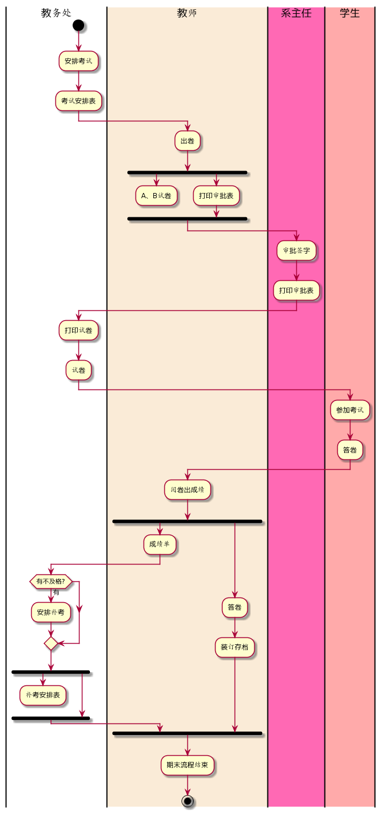
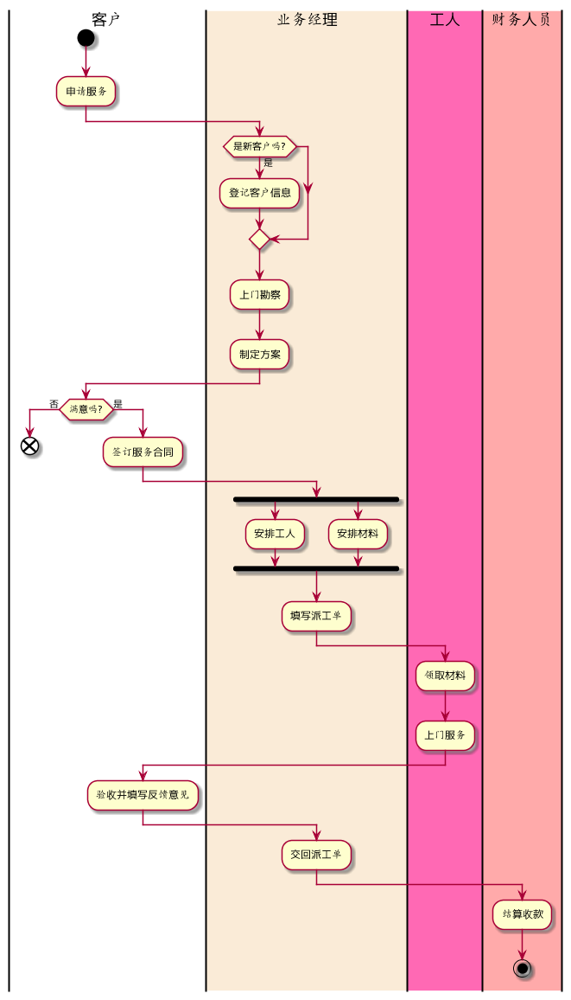

姓名：盛磊
班级：15软工2班
学号：201510414215


**PlantUML源码如下：**
```考试及成绩管理流程
@startuml
|教务处|
start
:安排考试;
:考试安排表;
|#AntiqueWhite|教师|
:出卷;
fork
   :A、B试卷;
   detach
 fork again
   :打印审批表;
 endfork
|#HotPink|系主任|
:审批签字;
:打印审批表;
|教务处|
:打印试卷;
:试卷;
|#FFAAAA|学生|
:参加考试;
:答卷;
|教师|
:阅卷出成绩;

fork 
   :成绩单;
   |教务处|
   if (有不及格?) then (有)
	:安排补考;
	endif
	fork
		:补考安排表;
		detach
	fork again
		|教师|
	end fork
fork again
   :答卷;
   :装订存档;
end fork
:期末流程结束;
stop
@enduml
```
业务流程图如下：<br>
<br>

**流程说明：**
教务处：安排考试->考试安排表；
教师：出卷->A、B卷；出卷->打印审批表；
系主任：审批签字->打印审批表；
教务处：打印试卷->试卷；
学生：参加考试->答卷；
教师：阅卷出成绩->成绩单；阅卷出成绩->答卷->装订存档；
教务处：有不及格？->安排补考->补考安排表；
教师：期末流程结束；

## 流程图2： 客户维修服务流程

**PlantUML源码如下：**

```客户维修服务流程
@startuml
|客户|
start
:申请服务;
|#AntiqueWhite|业务经理|
if (是新客户吗?) then (是)
	:登记客户信息;
	endif
:上门勘察;
:制定方案;
|客户|
if(满意吗?) then (否)
	end
else(是)
	:签订服务合同;

|业务经理|
fork
	:安排工人;
fork again
	:安排材料;
end fork
:填写派工单;
|#HotPink|工人|
:领取材料;
:上门服务;
|客户|
:验收并填写反馈意见;
|业务经理|
:交回派工单;
|#FFAAAA|财务人员|
:结算收款;
stop
@enduml
```
业务流程图如下：<br>
<br>
