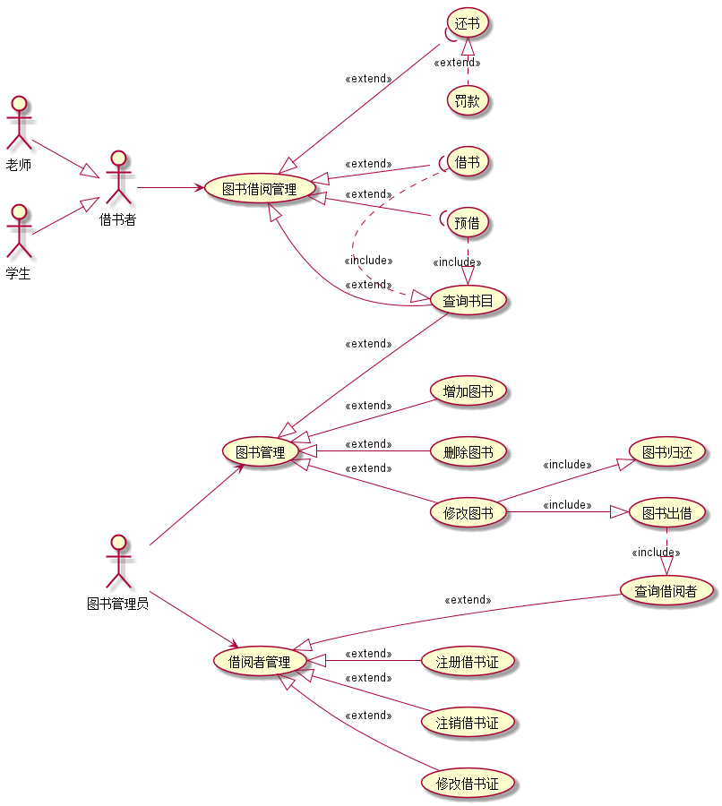
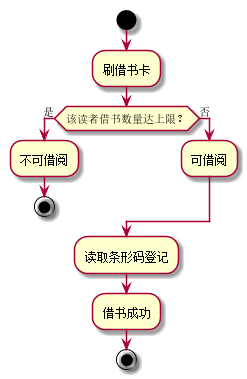
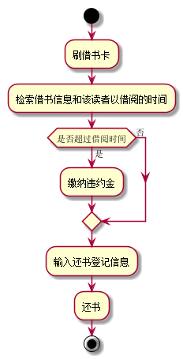
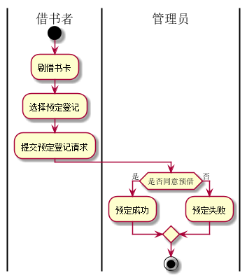

# 实验2：图书管理系统用例建模
======
| 学号 | 班级 | 姓名 | 照片 |
| ---- | ---  | ---- | ---- |
| 201510414215 | 2班| 盛磊|  |


## 1. 图书管理系统的用例关系图

### 1.1 用例图PlantUML源码如下：

``` usecase
@startuml
left to right direction
:图书管理员: as admin
:借书者: as brow
:老师: as teacher
:学生: as student
teacher--|>brow
student--|>brow
admin-->(借阅者管理)
admin-->(图书管理)
(借阅者管理)<|--(注册借书证):<<extend>>
(借阅者管理)<|--(注销借书证):<<extend>>
(借阅者管理)<|--(修改借书证):<<extend>>
(借阅者管理)<|--(查询借阅者):<<extend>>

(图书管理)<|--(查询书目):<<extend>>
(图书管理)<|--(增加图书):<<extend>>
(图书管理)<|--(删除图书):<<extend>>
(图书管理)<|--(修改图书):<<extend>>
(修改图书)--|>(图书归还):<<include>>
(修改图书)--|>(图书出借):<<include>>
(图书出借).|>(查询借阅者):<<include>>
brow-->(图书借阅管理)
(图书借阅管理)<|--(查询书目):<<extend>>
(图书借阅管理)<|--((借书):<<extend>>
(图书借阅管理)<|--((还书):<<extend>>
(图书借阅管理)<|--((预借):<<extend>>
(还书)<|.(罚款):<<extend>>
(借书).|>(查询书目):<<include>>
(预借).|>(查询书目):<<include>>
@enduml
```


### 1.2. 用例图如下：



## 2. 参与者说明：

###     2.1 图书管理员

```
主要职责是：
	图书管理
		增加图书
		删除图书
		修改图书
		图书出借
		图书归还
		查询书目
	    借阅者管理
		注册借书证
		注销借书证
		修改借书证
		查询借阅者
```
###     2.2 借书者
```
主要职责是：
	    图书借阅管理
		查询书目
		预借
		借书
		还书
```
###     2.3 老师、学生
```
主要职责是：
	（具体的借书者）图书借阅管理
```

##     3. 用例规约表

###     3.1 “借书”用例

|Title | 内容 |
|:------:|:------:|
|用例名称|借出图书|
|参与者|图书管理员（主要参与者）、借阅者（次要参与者）|
|前置条件|图书管理员确认借阅者所节约的图书信息|
|后置条件|更新图书库存，图书借阅信息更新，借阅者借阅信息更新|
|主事件流|1.借阅者提供相应证件；<br>2.系统验证借阅者身份和图书信息；<br>3.图书管理员将借阅者信息和图书录入系统；<br>4.系统更新借阅者和图书信息；<br>5系统累加读者的借书数量；<br>6.重复3~5，直到图书管理员确认全部图书登记完毕；<br>7.系统打印借书清单，借书完成|

###     3.2 “还书”用例

|Title | 内容 |
 |:------:|:------:|
 |用例名称|还原图书|
 |参与者|图书管理员（主要参与者）、借阅者（次要参与者）|
 |前置条件|图书管理员确认借阅者所节约的图书信息|
 |后置条件|更新图书库存，图书借阅信息更新，借阅者借阅信息更新|
 |主事件流|1.借阅者提供所借图书；<br>2.系统验证图书是否逾期，图书管理员验证图书是否损坏；<br>3.图书管理员将符合还书条件的图书的信息录入系统；<br>4.更新图书信息和借阅者信息；<br>5.系统记录还书信息，并且修改图书的状态和此书的可借数量；<br>6.系统打印还书清单，还书完成|
 |备注|还书须由图书管理员完成|


###     3.3 “预借”用例
|Title | 内容 |
 |:------:|:------:|
|用例名称:|预借|
|角色:|借书者，图书管理员|
|用例说明:|读者刷卡，系统检索并显示出该读者在借图书信息和该读者已借阅的时间;|
|前置条件:|图书馆缺少该图书|
|后置条件:|用户预订成功|
|主事件流:|参与者动作|系统行为|
||1.图书管理员选择“预订登记”提交“预订登记”请求;3.还书者输入预订登记信息|2.系统显示“预订登记”空白窗口;4.系统列表显示出该读者想要预定的图书信息|
|备用事件流:|参与者动作|系统行为|


**“借书”用例流程图源码如下：**
``` 
@startuml
start
:刷借书卡;
if (该读者借书数量达上限？) then (是)
:不可借阅;
stop
else(否)
:可借阅;
endif
:读取条形码登记;
:借书成功;
stop
@enduml
```

**“借书”用例流程图如下：**




**“还书”用例流程图源码如下：**
``` 
@startuml
start
:刷借书卡;
:检索借书信息和该读者以借阅的时间;
if (是否超过借阅时间) then (是)
:缴纳违约金;
else(否)
endif
:输入还书登记信息;
:还书;
stop
@enduml
```

**“还书”用例流程图如下：**




**“预借”用例流程图源码如下：**
``` 
@startuml
|借书者|
start
:刷借书卡;
:选择预定登记;
:提交预定登记请求;
|管理员|
if (是否同意预借) then (是)
:预定成功;
else(否)
:预定失败;
endif
stop
@enduml
```

**“预借”用例流程图如下：**


