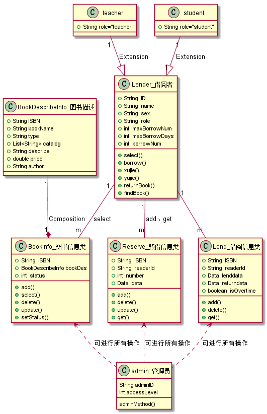
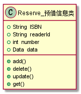
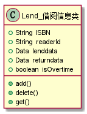
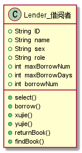
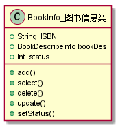
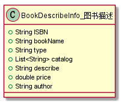

# 实验3：图书管理系统领域对象建模
| 学号 | 班级 | 姓名 | 照片 |
| ---- | ---  | ---- | ---- |
| 201510414215 | 2班| 盛磊|  |
## 1. 图书管理系统的类图

### 1.1 类图PlantUML源码如下：

``` class
@startuml
class Reserve_预借信息类{
    +String  ISBN
    +String  readerId
    +int  number
    +Data  data
    +add()
    +delete()
    +update()
    +get()
}
class Lend_借阅信息类{
    +String  ISBN
    +String  readerId
    +Data  lenddata
    +Data  returndata
    +boolean  isOvertime
    +add()
    +delete()
    +get()
}

class Lender_借阅者{
    +String  ID
    +String  name
    +String  sex
    +String  role
    +int  maxBorrowNum
    +int  maxBorrowDays
    +int  borrowNum
    +select()
    +borrow()
    +xujie()
    +yujie()
    +returnBook()
    +findBook()
}
class BookInfo_图书信息类{
    +String  ISBN
    +BookDescribeInfo bookDes
    +int  status
    +add()
    +select()
    +delete()
    +update()
    +setStatus()
}
class BookDescribeInfo_图书描述{
    +String ISBN
    +String bookName
    +String type
    +List<String> catalog
    +String describe
    +double price
    +String author
}
class teacher{
    +String role="teacher"
}
class student{
    +String role="student"
}
class admin_管理员{
    String adminID
    int accessLevel
    adminMethod()
}
teacher"1" --|> "1"Lender_借阅者:Extension
student"1" --|> "1"Lender_借阅者:Extension
BookDescribeInfo_图书描述"1" --* "1"BookInfo_图书信息类:Composition
Lender_借阅者"1" -- "m"BookInfo_图书信息类:select
Lender_借阅者"1" -- "m"Reserve_预借信息类:add、get
Lender_借阅者"1" -- "m"Lend_借阅信息类
BookInfo_图书信息类 <.. admin_管理员:可进行所有操作
Reserve_预借信息类 <.. admin_管理员:可进行所有操作
Lend_借阅信息类  <.. admin_管理员:可进行所有操作
@enduml
```

### 1.2. 类图如下：



### 1.3. 类图说明：
```
Lender_借阅者有两个子类分别是teacher和student
BookDescribeInfo_图书描述是BookInfo_图书信息类的一部分
lender和admin可以对图书信息类、预借信息类、借阅信息类进行操作但是操作的权限不同
比如：lender只能对BookInfo进行select操作，但是管理员能对其进行更多的删改添加操作
```


## 2. 图书管理系统的对象图
### 2.1 类Reserve
#### 源码如下：
``` class
@startuml
class Reserve_预借信息类{
    +String  ISBN
    +String  readerId
    +int  number
    +Data  data
    +add()
    +delete()
    +update()
    +get()
}
@enduml
``` 
#### 对象图如下：

#### 说明：
```
Reserve：预借信息类
	属性：
		ISBN：图书编号
		readerId：读者ID
		number：预借数量
		data：借书日期
	方法：
		add()：添加一条预借记录
		delete()：删除一条预借记录
		update()：修改预借记录
		get():获取预借信息
```

### 2.2 类Lend
#### 源码如下：
``` class
@startuml
class Lend_借阅信息类{
    +String  ISBN
    +String  readerId
    +Data  lenddata
    +Data  returndata
    +boolean  isOvertime
    +add()
    +delete()
    +get()
}
@enduml
``` 
#### 对象图如下：


#### 说明：
```
Lend：借阅信息类
	属性：
		ISBN：图书编号
		readerId：读者ID
		lenddata：借书日期
		returndata：还书日期
		isOvertime：是否超时
	方法：
		add()：添加一条借书记录
		delete()：删除一条借书记录
		get():获取借书信息
```
### 2.3 类Lender
#### 源码如下：
``` class
@startuml
class Lender_借阅者{
    +String  ID
    +String  name
    +String  sex
    +String  role
    +int  maxBorrowNum
    +int  maxBorrowDays
    +int  borrowNum
    +select()
    +borrow()
    +xujie()
    +yujie()
    +returnBook()
    +findBook()
}
@enduml
``` 
#### 对象图如下：


#### 说明：
```
Lender：借阅者
	属性：
		ID：读者ID
		name：姓名
		sex：性别
		role：借阅者类型
		maxBorrowDays：最大借阅天数
		maxBorrowNum:最大借阅数量
		borrowNum:已借数量
	方法：
		select()：查询自己的借阅记录
		borrow()：借书
		xujie():续借图书
		yujie():预借图书
		returnBook()：归还图书
		findBook():查询图书信息
```

### 2.4 类BookInfo
#### 源码如下：
``` class
@startuml
class BookInfo_图书信息类{
    +String  ISBN
    +BookDescribeInfo bookDes
    +int  status
    +add()
    +select()
    +delete()
    +update()
    +setStatus()
}
@enduml
``` 
#### 对象图如下：


#### 说明：
```
BookInfo：图书信息类
	属性：
		ISBN：图书编号
		bookDes：图书信息描述
		status：图书状态：标记借出、预借、可借阅状态
	方法：
		add()：添加图书
		delete()：删除图书
		select():查询图书
		updata():更新图书
		setStatus():设置图书状态
```
### 2.5 类BookDescribeInfo
#### 源码如下：
``` class
@startuml
class BookDescribeInfo_图书描述{
    +String ISBN
    +String bookName
    +String type
    +List<String> catalog
    +String describe
}
@enduml
``` 
#### 对象图如下：


#### 说明：
```
BookDescribeInfo：图书描述类
	属性：
		ISBN：图书编号
		bookName：书名
		type：图书类型
		catalog：目录
		describe：图书简介
```