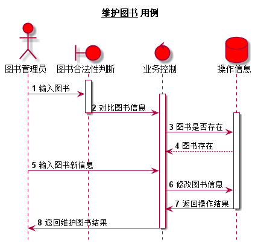

## 实验四：图书管理系统的顺序图
| 学号 | 班级 | 姓名 | 照片 |
| ---- | ---  | ---- | ---- |
| 201510414215 | 2班| 盛磊|  |

### 1.维护读者信息

**1.1 维护读者信息用例PlantUML源码**
~~~
@startuml
hide footbox
title __维护读者信息__ 用例
actor 图书管理员 #red
boundary 账号判断 #red
control 业务控制 #red
database 操作信息 #red

autonumber

activate 账号判断
	图书管理员 -> 账号判断 :  输入读者账号
	activate 业务控制
		账号判断 -> 业务控制 : 获取账号
deactivate 账号判断
		activate 操作信息
			业务控制 -> 操作信息 : 比对账号密码合法性
			操作信息 --> 业务控制 : 账号合法
			图书管理员 -> 业务控制 : 输入读者新信息
			业务控制 -> 操作信息 : 修改读者信息
			操作信息 -> 业务控制 : 返回操作结果
		deactivate 操作信息
	业务控制 -> 图书管理员 : 返回维护读者信息结果
	deactivate 业务控制

@enduml
~~~
**1.2 维护读者信息用例顺序图**

**1.3 维护读者信息用例顺序图说明**
1.参与者：图书管理员(actor)、账号判断(boundary)、业务控制(control)、数据库(database)。
2.消息：(1)读者账号合法性判断：输入读者账号信息->获取账号信息->对比账号密码合法性->账号合法
       (2)维护读者信息：输入读者新信息->修改读者信息->返回操作结果->返回维护读者信息结果
 
       
### 2.查询图书

**2.1 查询图书用例PlantUML源码**
~~~
@startuml

hide footbox
title 查询图书 用例
actor 游客 #red
control 业务控制 #red
database 操作信息 #red
entity 图书信息 #red

autonumber

	游客 -> 业务控制 :  输入图书
		activate 操作信息
			业务控制 -> 操作信息 : 查询对应图书
			操作信息 -> 业务控制 : 返回查询结果
		deactivate 操作信息
		activate 图书信息
			业务控制 -> 图书信息 : 生成图书信息列表
		deactivate 业务控制
			图书信息 -> 游客	: 返回图书信息
		deactivate 图书信息

@enduml
~~~
**2.2 查询图书用例顺序图**

**2.3 查询图书用例顺序图说明**
1.参与者：游客(actor)、业务控制(control)、数据库(database)、图书信息(entity)。
2.消息：输入图书信息->根据图书信息查询对应图书->返回查询结果->生成图书信息列表->返回图书信息

### 3.借出图书

**3.1 借出图书用例PlantUML源码**
~~~
@startuml
hide footbox
title 借出图书用例
actor 图书管理员 #red
boundary 账号信息判断 #red
control 业务控制 #red
database 操作信息 #red

autonumber

activate 账号信息判断
	图书管理员 -> 账号信息判断 :  输入读者账号
	activate 业务控制
		账号信息判断 -> 业务控制 : 获取账号信息
deactivate 账号信息判断
		activate 操作信息
			业务控制 -> 操作信息 : 比对账号密码合法性
			操作信息 --> 业务控制 : 账号信息合法
			图书管理员 -> 业务控制 : 输入图书信息
			业务控制 -> 操作信息 : 增加借阅信息
			业务控制 -> 操作信息 : 修改图书库存
			操作信息 -> 业务控制 : 返回操作信息
		deactivate 操作信息
	业务控制 -> 图书管理员 : 返回业务控制结果
	deactivate 业务控制

@enduml

~~~
**3.2 借出图书用例顺序图**

**3.3 借出图书用例顺序图说明**
1.参与者：图书管理员(actor)、账号判断(boundary)、业务控制(control)、数据库(database)。
2.消息：(1)读者账号合法性判断：输入读者账号信息->获取账号信息->对比账号密码合法性->账号合法
       (2)借出图书：输入借出图书信息->增加借阅信息->修改图书库存->返回借出结果

### 4.归还图书

**4.1 归还图书用例PlantUML源码**
~~~
@startuml
hide footbox
title 图书归还 用例
actor 图书管理员  #red
boundary 账号判断 #red
control 业务控制 #red
database 操作信息 #red

autonumber

activate 账号判断
	图书管理员 -> 账号判断 :  输入读者账号
	activate 业务控制
		账号判断 -> 业务控制 : 获取账号
deactivate 账号判断
		activate 操作信息
			业务控制 -> 操作信息 : 比对账号密码合法性

			图书管理员 -> 业务控制 : 输入归还图书的
			业务控制 -> 操作信息 : 修改保存图书借阅
			业务控制 -> 操作信息 : 修改图书库存
			操作信息 -> 业务控制 : 返回操作结果
		deactivate 操作信息
	业务控制 -> 图书管理员 : 返回还书是否成功
	deactivate 业务控制

@enduml
~~~
**4.2 归还图书用例顺序图**

**4.3 归还图书用例顺序图说明**
1.参与者：图书管理员(actor)、账号判断(boundary)、业务控制(control)、数据库(database)。
2.消息：(1)读者账号合法性判断：输入读者账号信息->获取账号信息->对比账号密码合法性->账号合法
       (2)归还图书：输入归还图书信息->删除借阅信息->修改图书库存->返回操作结果->返回归还结果

### 5.查询借阅信息

**5.1 查询借阅信息用例PlantUML源码**
~~~
@startuml

hide footbox
title 查询借阅信息 用例
actor 读者 #red
boundary 权限判断 #red
control 业务控制 #red
database 操作信息 #red
entity 借书记录 #red

autonumber
activate 权限判断
	读者 -> 权限判断 :  输入账号
	activate 业务控制
		权限判断 -> 业务控制 : 获取账号
deactivate 权限判断
		activate 操作信息
			业务控制 -> 操作信息 : 比对账号密码合法性
			操作信息 --> 业务控制 : 账号合法，成功登录
    读者->业务控制: 输入借阅图书信息
	业务控制 -> 操作信息 : 查询借阅表
	操作信息 -> 业务控制 : 返回查询结果
	deactivate 操作信息
	activate 借书记录
		业务控制 -> 借书记录 : 生成借书记录列表
	deactivate 业务控制
		借书记录 -> 读者 : 返回图书查询结果
	deactivate 借书记录

@enduml
~~~
**5.2 查询借阅信息用例顺序图**

**5.3 查询借阅信息用例顺序图说明**
1.参与者：读者(actor)、权限判断(boundary)、业务控制(control)、数据库(database)、借书记录(entity)。
2.消息：(1)账号合法性判断：输入账号信息->获取账号信息->对比账号密码合法性->账号合法
       (2)借书记录：查询借阅表->返回查询结果->生成借书记录列表->返回查询结果

### 6.图书信息维护

**6.1 图书信息维护PlantUML源码**
~~~
@startuml
skinparam backgroundColor #EEEBDC

hide footbox
title __维护图书__ 用例
actor 图书管理员 
boundary 图书合法性判断
control 业务控制
database 操作信息

autonumber
group 图书信息验证
activate 图书合法性判断
	图书管理员 -> 图书合法性判断 :  输入图书ISBN
	activate 业务控制
		图书合法性判断 -> 业务控制 : 对比图书信息
deactivate 图书合法性判断
		activate 操作信息
			业务控制 -> 操作信息 : 图书是否存在
			操作信息 --> 业务控制 : 图书存在
end
group 维护图书
			图书管理员 -> 业务控制 : 输入图书新信息
			业务控制 -> 操作信息 : 修改图书信息
			操作信息 -> 业务控制 : 返回操作结果
		deactivate 操作信息
	业务控制 -> 图书管理员 : 返回维护图书结果
	deactivate 业务控制
	

end

@enduml
~~~
**6.2 图书信息维护用例顺序图**

