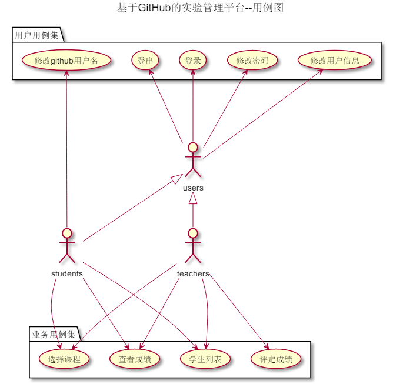
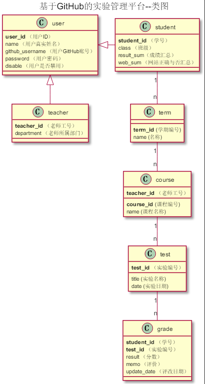

# 基于GitHub的实验管理平台的分析与设计

### 成都大学信息科学与工程学院

|学号|班级|姓名|
|:-------:|:-------------: | :----------:|
|201510414215|软件(本)15-2|盛磊|

## 1. 概述
- 基于GitHub的实验管理平台的作用是在线管理实验成绩的Web应用系统。学生和老师的实验内容均存放在GitHUB
页面上。
- 学生的功能主要有：一是设置自己的GitHub用户名，二是查询自己的实验成绩。学生的GitHub用户名是公开的，但成绩不公开。
- 老师的功能主要有：一是批改每个学生的成绩，二是查看每个学生的成绩。
- 老师能通过本系统的链接方便地跳转到学生的每个GitHUB实验目录，以便批改实验或者查看实验情况。
- 一个老师可以上多门课，每个老师只能维护老师自己的课程及成绩。
- 一人同学可以上多门课，每个同学只能查询同学自己的课程的实验成绩。
- 系统自动计算出每个实验的所有评分项的成绩之和为该实验的总成绩。
- 实验成绩按数字分数计算，每项实验的满分为100分，最低为0分。
- 系统自动计算每个学生的所有实验的平均分。
    
## 2. 系统总体结构

界面设计参见：https://shenglei592485.github.io/is_analysis/test6/UI/index.html
    
## 3. 用例图设计 [源码](UseCase.puml)

## 4. 类图设计 [源码](Class.puml)

## 5. 数据库设计
- ### [参见数据库设计](数据库设计.md)

## 6. 用例及界面详细设计
- ### [“学生列表”用例](用例/学生列表.md),[界面](https://shenglei592485.github.io/is_analysis/test6/UI/index.html)
- ### [“评定成绩”用例](用例/评定成绩.md),[界面](https://shenglei592485.github.io/is_analysis/test6/UI/评定成绩.html)
- ### [“查看成绩”用例](用例/查看成绩.md),[界面](https://shenglei592485.github.io/is_analysis/test6/UI/学生个人信息查看页面.html)
- ### [“修改密码”用例](用例/修改密码.md),[界面](https://shenglei592485.github.io/is_analysis/test6/UI/学生修改信息页面.html)
- ### [“修改用户信息”用例](用例/修改用户信息.md),[界面](https://shenglei592485.github.io/is_analysis/test6/UI/学生修改信息页面.html)
- ### [“查看用户信息”用例](用例/查看用户信息.md),[界面](https://shenglei592485.github.io/is_analysis/test6/UI/学生个人信息查看页面.html)
- ### [“登出”用例](用例/登出.md),[界面](https://shenglei592485.github.io/is_analysis/test6/UI/index.html)
- ### [“登录”用例](用例/登录.md),[界面](https://shenglei592485.github.io/is_analysis/test6/UI/登录界面.html)
