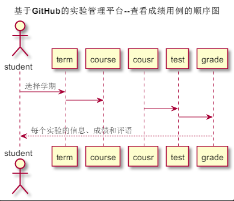

# “查看成绩”用例 [返回](../README.md)
## 1. 用例规约

|用例名称|查看成绩|
|-------|:-------------|
|功能|学生查看自己的每个实验的实验成绩及实验评价|
|参与者|学生|
|前置条件|学生需要先登录|
|后置条件| |
|主事件流| |
|备选事件流| |

## 2. 业务流程（顺序图） [源码](../顺序图/查看成绩.puml)
 

## 3. 界面设计
- 界面参照: https://shenglei592485.github.io/is_analysis/test6/UI/学生个人信息查看页面.html
- API接口调用
    - 接口1：[getOneStudentResults](../接口/getOneStudentResults.md) 

## 4. 算法描述
    无
    
## 5. 参照表
- [STUDENT](../数据库设计.md/#STUDENTS)
- [COURSE](../数据库设计.md/#TESTS)
- [TERM](../数据库设计.md/#TESTS)
- [GRADE](../数据库设计.md/#GRADES)
- [TEST](../数据库设计.md/#TESTS)
